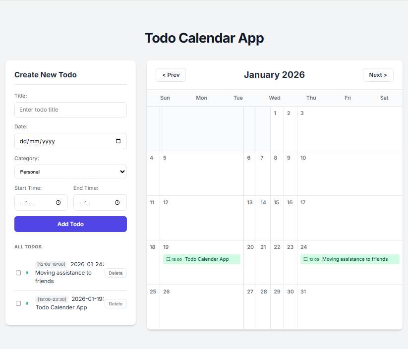
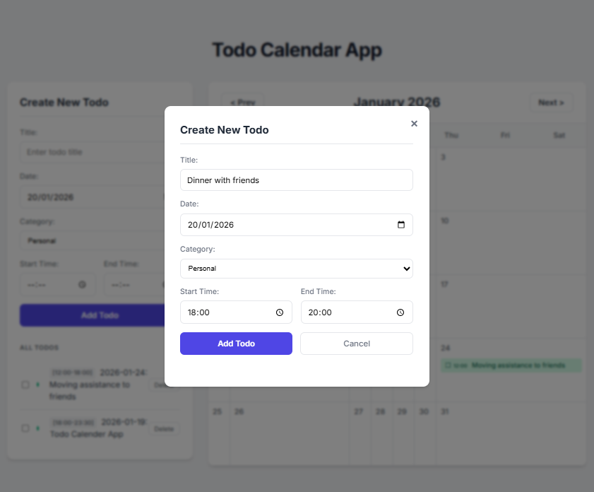

# Todo Calendar App

A persistent Todo application with a Calendar view, drag-and-drop rescheduling, and category management.

On this project, a modern Todo Calendar Application were build from the ground up with AntiGravity and ChatGPT, evolving it from a basic MVP into a feature-rich productivity tool.

Core Accomplishments
- **Full-Stack Architecture**: Established a Node.js backend using `json-server` for persistent storage and a React frontend built with Vite.
- **Calendar View**: Developed a custom monthly calendar component that dynamically renders todo items as "events," moving beyond a standard list format.
- **Drag-and-Drop Rescheduling**: Implemented interactive drag-and-drop functionality, allowing you to move todos between calendar dates to quickly update their deadlines.
- **Task Management (CRUD+)**:
  - Full Create, Read, Update, and Delete capabilities.
  - Integrated an Edit Modal for fine-tuning task details (title, time range, etc.).
  - Added Category Management with color-coded tags (Work, Personal, Urgent, etc.) for better visual organization.

- **Persistence**: Ensured all data is saved locally to a `db.json` file, so your schedule is preserved across browser refreshes and server restarts.

The current state is a clean, responsive interface that combines traditional todo management with a visual planning workflow.
## Screenshots


## Project Structure
- **client/**: React frontend (Vite)
- **server/**: Node.js backend (json-server)

## How to Run

### 1. Start the Backend
The backend runs on port `3001` and handles data persistence in `server/db.json`.

```bash
cd server
npm run dev
```

### 2. Start the Frontend
The frontend runs on port `5173` (by default).

```bash
cd client
npm run dev
```

Open your browser to the URL shown in the client terminal (usually http://localhost:5173).

## Features
- **Create/Edit Todos**: Title, Date, Time Range, Category.
- **Drag & Drop**: Drag events on the calendar to reschedule.
- **Categories**: Color-coded categories (Work, Personal, Urgent, Other).
- **Persistence**: Data is saved automatically to `server/db.json`.
