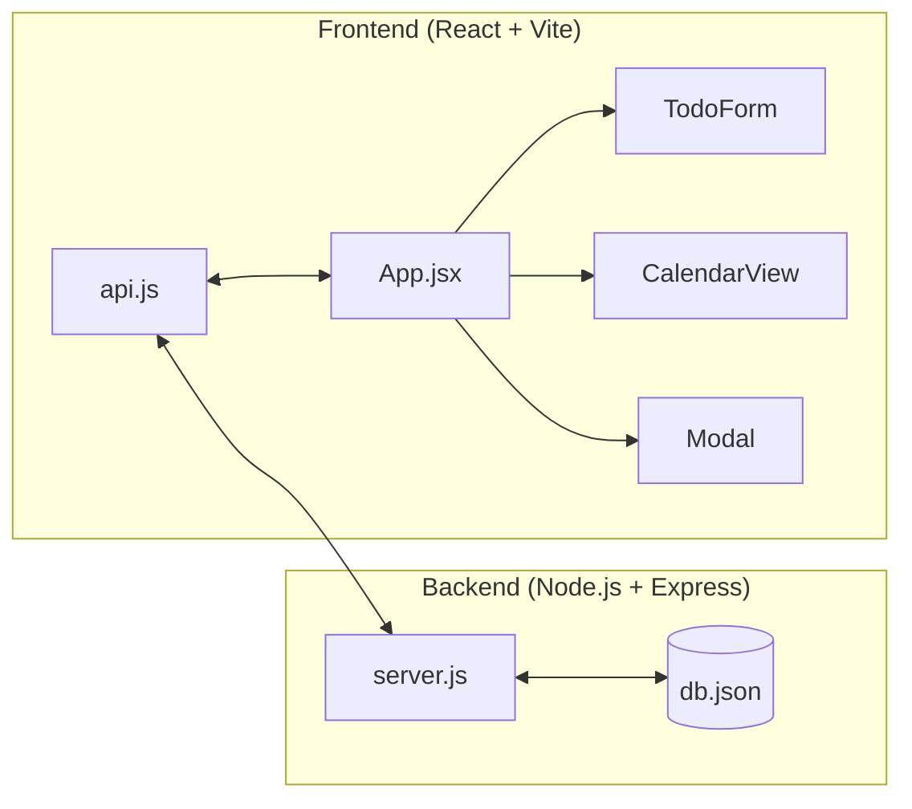

# Technical Architecture Overview: Todo Calendar App

This document provides a deep dive into the system design, component logic, and data flow of the Todo Calendar application.

---

## 🏗 High-Level Architecture

The application follows a standard **Client-Server** architecture:

- **Frontend**: A Single Page Application (SPA) built with React, leveraging modern hooks for state management.
- **Backend**: A RESTful API built using `json-server`, which provides a full fake REST API with zero coding, backed by a JSON file.
- **Communication**: Asynchronous HTTP requests using the `fetch` API.

---

## 📂 Project Structure

- `/client`: React frontend source code.
  - `src/App.jsx`: The "Brain" of the app. Manages global state and orchestrates components.
  - `src/api.js`: Data Access Layer. Contains all `fetch` calls.
  - `src/components/`: Modular UI components.
  - `src/App.css`: Centralized design system and animations.
- `/server`: Backend persistence.
  - `server.js`: Configures the json-server middleware.
  - `db.json`: The source of truth (Database).

---

## 🛠 Feature Deep-Dives

### 1. State Management & Data Flow
The `App.jsx` component maintains the `todos` state.
- **Initial Load**: `useEffect` calls `fetchTodos()`, which uses `getTodos()` from `api.js`.
- **Reactivity**: When a todo is created, updated, or deleted, the frontend waits for the API response and then re-fetches the list to ensure the UI stays synchronized with the database.

### 2. Modal System & Editing
We use a **Contextual Modal** to handle both creation and editing.
- **Function**: `handleEditTodo(todo)`
- **Logic**: When a todo is clicked in the calendar, `isModalOpen` is set to `true` and the `editingTodo` state is populated.
- **Component Reuse**: The `TodoForm` detects the presence of `todoToEdit` to switch from "Create" to "Edit" mode, pre-filling the inputs via `useEffect`.

### 3. Drag & Drop Rescheduling
Leverages the native **HTML5 Drag and Drop API**.
- **Draggable**: Calendar event items have `draggable="true"` and an `onDragStart` handler that attaches the `todo.id` to the data transfer.
- **Droppable**: Each calendar day cell implements `onDrop`. It extracts the `todo.id` and calls `onUpdateDate(id, newDate)`, which triggers a `PATCH` request to the backend.

### 4. Categorization & Appearance
- **Categorization**: Todos are tagged with a `category` (Personal, Work, Urgent, Other).
- **CSS Variables**: `App.css` defines a color palette using variables for easy maintenance. Category colors are applied via dynamic class names: `cat-${todo.category.toLowerCase()}`.

---

## ⚡ Key Functions Reference

| Function | Component | Purpose |
| :--- | :--- | :--- |
| `fetchTodos` | `App.jsx` | Syncs local state with backend API. |
| `handleTodoCreated` | `App.jsx` | Switches logic between `POST` (new) and `PATCH` (update). |
| `renderDays` | `CalendarView` | Calculates calendar grid geometry and maps todos to dates. |
| `handleSubmit` | `TodoForm` | Validates input and triggers the creation flow. |
| `Modal` | `Modal.jsx` | A "Higher Order" style component using `{children}` for flexibility. |

---

## 🚀 Performance & UI UX
- **Animations**: Uses CSS `@keyframes` for smooth modal transitions.
- **Non-Blocking**: All API calls are asynchronous (`async/await`), ensuring the interface never freezes during data operations.
- **Persistence**: `json-server` automatically writes to `db.json` every time a change is made, ensuring no data loss on refresh.
